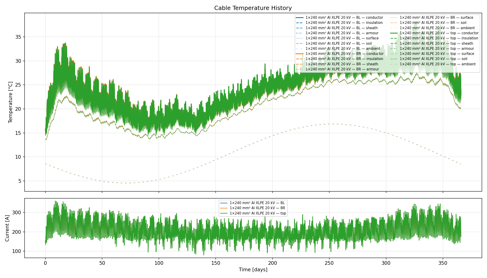

Liander load shape — trefoil Al XLPE
====================================

**Script:** ``examples/seasonal_liander_trefoil_al.py``

A full-year transient for three single-core **240 mm² Al XLPE** cables in
**touching trefoil**, driven by **15-minute** operational load data from Liander’s
open dataset (bundled as ``examples/data/OS_Apeldoorn.csv``).  The CSV values are
not amperes; the script maps their magnitude to a plausible phase-current band
for illustration.

Setup
-----

- **Cables:** 3 × 1 × 240 mm² Al XLPE, 20 kV, balanced same current
- **Geometry:** Trefoil (touching), centroid burial depth 1.2 m
- **Load:** Liander station-installation series (OS Apeldoorn sample), scaled to
  roughly 80–360 A per phase (tunable via ``I_PEAK_A`` / ``I_MIN_A``)
- **Ground temperature:** Kasuda model tuned for the Netherlands (mean ~10.7 °C,
  annual amplitude ~10.5 °C)
- **Time step:** 900 s (15 min), matching the CSV

What it demonstrates
--------------------

1. Building a :class:`LoadProfile <thermal_cable_model.LoadProfile>` from a
   real-world time series (datetime CSV + forward-fill for sparse DST rows)
2. Year-long transients with **quarter-hour** resolution
3. Trefoil mutual heating with **aluminium** conductors and seasonal soil temperature

Data and licence
----------------

The sample CSV is from `Liander open data — historische 15-minuten bedrijfsmetingen
<https://www.liander.nl/over-ons/open-data#historische-15-minuten-bedrijfsmetingen>`_.
Use is subject to Liander’s disclaimer; the trace reflects aggregated substation
behaviour, not a single feeder.

Output files
------------

- ``seasonal_liander_trefoil_al_temperatures.png`` — temperature and current history
  (regenerate by running the script; a copy is kept under ``docs/_static/examples/``
  for the documentation build).

   Temperature and current history produced by ``examples/seasonal_liander_trefoil_al.py``.
